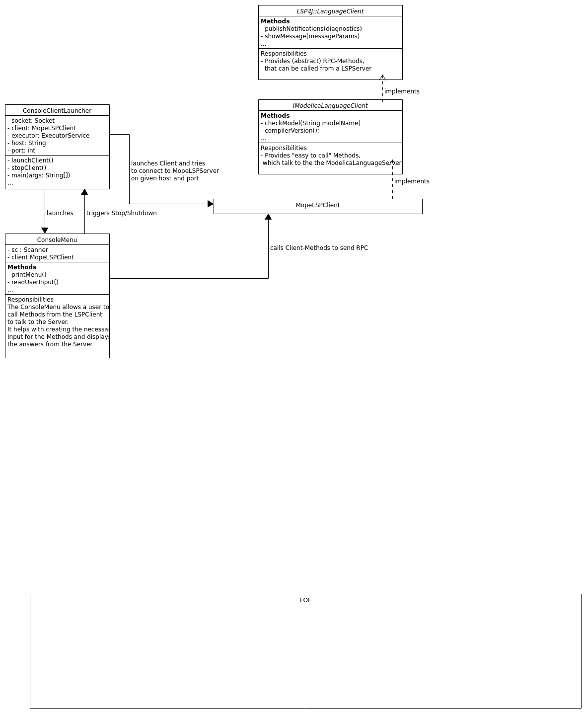

# Client Architecture
- [Client Architecture](#client-architecture)
  - [ConsoleClientLauncher](#consoleclientlauncher)
  - [ConsoleMenu](#consolemenu)
  - [MopeLSPClient](#mopelspclient)
  - [_UML_](#uml)

## ConsoleClientLauncher
The ConsoleClientLauncher is responsible for starting the MopeLSPClient.
It connects a socket to the given port and host address, launches an instance of MopeLSPClient and connects it In- and Out-putStreams to the socket.
Afterwards it presents the User a ConsoleMenu and keeps running until the User exited that Menu.
## ConsoleMenu
The ConsoleMenu is responsible for:
- Guiding the User so he knows what to input
- Reading the UserInput
- Calling the requested _WrapperMethod_ in the MopeLSPClient
- Printing the Answers from the Server
## MopeLSPClient
MopeLSPClient is an implementation of the LSP4J::LanguageClient. It implements RPC's like:
- showMessage
- publishDiagnostics

For more Information about client side RPC's you can have a look into the official LSP-Specification.

Additionally, the MopeLSPClient contains _WrapperMethods_ to call RPC's on  the server side.

#### DesignPatterns

We should seperate the _WrapperMethods_ inside the Client from the actual Client.
I think a [Facade](https://en.wikipedia.org/wiki/Facade_pattern) would be good Pattern to apply here.
The Facade should have access to the MopeLSPClient and contain all the Methods used to send requests and notifications to the Server.

Afterwards the ConsoleMenu only calls facade-methods.
Maybe the Facade could also include some Events that are fired when the Server send a notification (eg. ShowMessage).
These Events could be subscribed by the ConsoleMenu. This would allow us to proper handle print this Message in the Menu and would improve separation of concerns.

## _UML_
