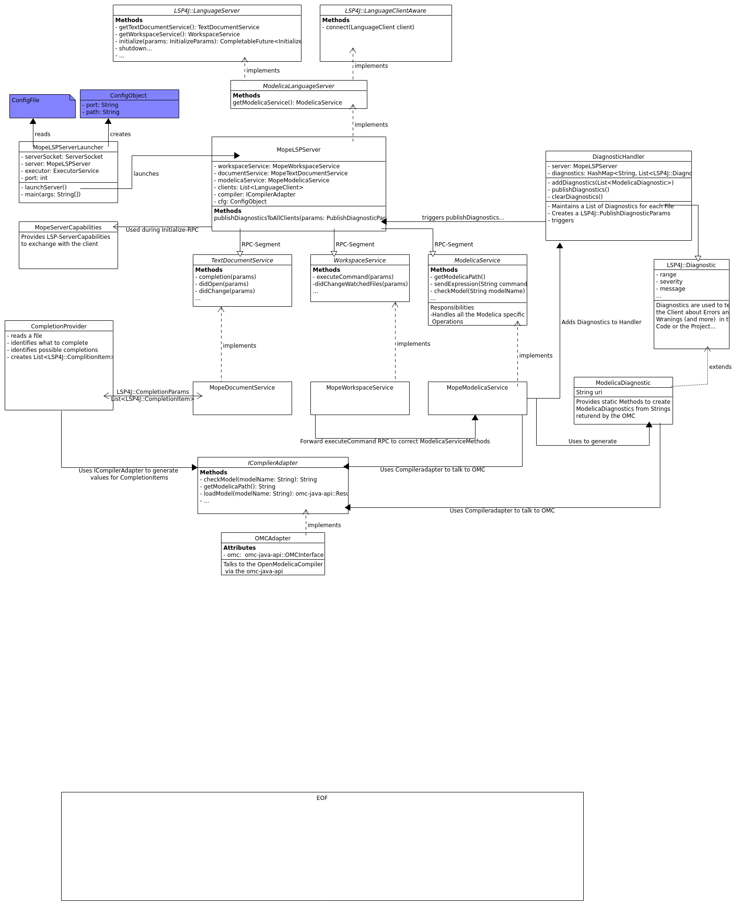

# Server Architecture
- [Server Architecture](#server-architecture)
  - [ICompilerAdapter](#icompileradapter)
    - [OMCAdapter](#omcadapter)
  - [MopeServerLauncher](#mopeserverlauncher)
  - [MopeLSPServer](#mopelspserver)
  - [MopeWorkspaceService](#mopeworkspaceservice)
  - [MopeDocumentService](#mopedocumentservice)
  - [MopeModelicaService](#mopemodelicaservice)
  - [CompletionProvider](#completionprovider)
  - [DiagnosticHandler](#diagnostichandler)
    - [ModelicaDiagnostic](#modelicadiagnostic)
  - [_UML_](#uml)

## ICompilerAdapter
This Interface acts as a wrapper for a Modelica Compiler.
It contains Methods like:
- connect  (launching a compiler instance and connecting to it)
- exit  (disconnecting from the compiler and exiting the process)
- checkModel
- getCompilerPath
- sendExpression
- and quite a few more

#### DesignPatterns
The Name of this Interface indicates that it may be an [adapter](https://en.wikipedia.org/wiki/Adapter_pattern).
If I understand this Pattern correct, the Interface should not be an Adapter, but only the Implementation.
This is because an adapter is used to map the methods of Adaptee(omc-java-api ZeroMqClient) to the Target(Interface) required by the Client(MopeLSPServer).
To correctly use this pattern the at least the following steps are required:
- Rename ICompilerAdapter to ICompiler
- Don't let any ICompilerMethod return an omc-java-api::Result
  - because the Result is used in the ModelicaService to create ModelicaDiagnostics this may require some more changes 

Another Pattern that could make sense here is the [Singleton](https://en.wikipedia.org/wiki/Singleton_pattern).
The same instance of the CompilerInterface is used quite often on different locations in the code. Maybe a Singleton could clean up \
that a little and provide a bit more safety.
Currently, we create the Instance of the ICompilerInterface in the Constructor of the MopeLSPServer and inject it to all underlying classes via their Constructor.
This would allow us to instantiate a different implementation(e.g. JMCAdapter) based on the server configuration and were good to go.
I am sure there is some kind of DependencyInjectionFramework or some kind of fancy trick to apply the same behaviour to the Singleton.
### OMCAdapter

This is the implementation of the ICompilerAdapter-Interface responsible for managing requests to the OpenModelicaCompiler(OMC). It uses the omc-java-api to interact with the OMC.

It requires a valid path to the OMC-location. This path gets injected via the constructor.

## MopeServerLauncher
The MopeServerLauncher is responsible for starting the MopeLSPServer.
To do so it 
- tries to read a configuration-file
- opens a serverSocket
- launches an instance of MopeLSPServer
- adds clients that connect to the Socket

Furthermore this class is responsible to free all the used resources after the Server is shut down. 
#### DesignPatterns
Applying the Singleton pattern to the MopeServerLaucher would benefit the codequality

## MopeLSPServer
The MopeLSPServer is an implementation of the LSP4J::LanguageServer. It contains Methods like:
- initialize (initializes the Server, starts compilerProcess and exchanges capabilities with the Client)
- shutdown (Shuts down the Server Instance and exits the compilerProcess)
- get<_ServiceName_>Service (is used to call methods from the underlying service(JSON-RPC-Segment))

#### DesignPatterns
I don't see the Point of applying this any Pattern to this, but in Theory we don't want multiple Instances of the MopeLSPServer.
So we could use a Singleton her.
The same applies to the following:
- MopeWorkspaceService
- MopeDocumentService
- MopeModelicaService
- CompletionProvider

Another possibility would be to Create a [Builder](https://en.wikipedia.org/wiki/Builder_pattern) for the MopeServer.
which assembles the all the subclasses together and can be called inside the MopeServerLauncher.
Actually I think the MopeLSPServerLauncher already uses some kind of Builder to create a ServerLauncher. Maybe, we could extend that builder and add some more "chained"-Methods like `setCompiler`.

## MopeWorkspaceService
MopeWorkspaceService is responsible for all workspace-related operations. For more information consider taking a look at the official LSP-Specification.

To make the integration of Modelica-related commands on the client side as easy as possible the 'executeCommand' method is used to execute methods located in the MopeModelicaService. 

## MopeDocumentService
The responsibilities of this Service are everything related to TextDocuments.
For example:
- Opening a document
- Changing a document

Also this time refer to the official LSP-Specification for more information.

For now the MopeDocumentService only supports the `complete` operation.
## MopeModelicaService
The MopeModelicaService supplies Modelica specific functionality like semantic and syntactic analysis of models.
The Service uses an implementation to of [ICompilerAdapter](#icompileradapter) to interact with a Modelica compiler.
During some operations it uses the [ModelicaDiagnosticClass](#modelicadiagnostic) to generate Diagnostics and forward them to the [DiagnosticHandler](#diagnostichandler).

## CompletionProvider
The CompletionProvider is called from the MopeDocumentService to generate a List of LSP4J::CompletionItems which is forwarded to the Client calling the Complete-Request.
To do so the CompletionProvider opens the file where the completion is requested and searches for a keyword on the given position(line,character).
Depending on the type of the keyword, the CompletionProvider uses the ICompilerAdapter to search for the names of loaded Models.
#### DesignPattern
Maybe we should separate the logic related to creating CompletionItems.
Maybe we could use one of the following Patterns:
- [AbstractFactory](https://en.wikipedia.org/wiki/Abstract_factory_pattern)
- [FactoryMethod](https://en.wikipedia.org/wiki/Factory_method_pattern)

Maybe the methods `generateUncompletePackageCompletion` and `generateModelCompletionItem` are already some kind of FactoryMethod.
I'm not sure if these patterns require us to create a different Class for each Kind of CompletionItem.

## DiagnosticHandler
The DiagnosticHandler maintains multiple lists of Diagnostics organized in a hash map. One list for each file that contains Diagnostics.
On every change in any of the Diagnostics the Handler triggers the `publishDiagnosticsToAllClients` method provided by MopeLSPServer.   
#### DesignPatterns
The DiagnosticHandler should be a Singleton. Currently, it is only used inside the MopeModelicaService, but it is imaginable that Diagnostics could be created in many more Places inside the Code.
In this case it would only be beneficial to make sure that there is only one Instance of DiagnosticHandler to make sure all the Diagnostics are maintained in the same HashMap/List.
The concern regarding DependencyInjection mentioned [before](#icompileradapter) should not bother us here because we don't have another Implementation of DiagnosticHandler
### ModelicaDiagnostic
ModelicaDiagnostics extend the LSP4J::Diagnostic. It adds a String `URI` which indicates the file the Diagnostic is located in and is used by the DiagnosticHandler to add the Diagnostic to the correct list.
Furthermore it provides static Methods to create Diagnostics based on the result returned from ICompilerAdapter Methods like `checkModel` or `loadModel`.

#### DesignPattern
Maybe we should separate the logic related to creating ModelicaDiagnostics.
Maybe we could use one of the following Patterns:
- [AbstractFactory](https://en.wikipedia.org/wiki/Abstract_factory_pattern)
- [FactoryMethod](https://en.wikipedia.org/wiki/Factory_method_pattern)

Maybe the methods `CreateDiagnostics` and `CreateModelNotLoadedDiagnostic` are already some kind of FactoryMethod.
Im not sure if these patterns require us to create a different Class for ModelicaDiagnostics and ClassNotFoundDiagnostics.

## _UML_

